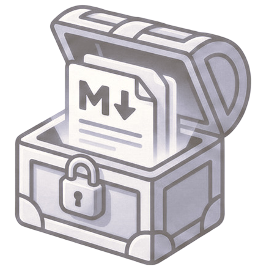
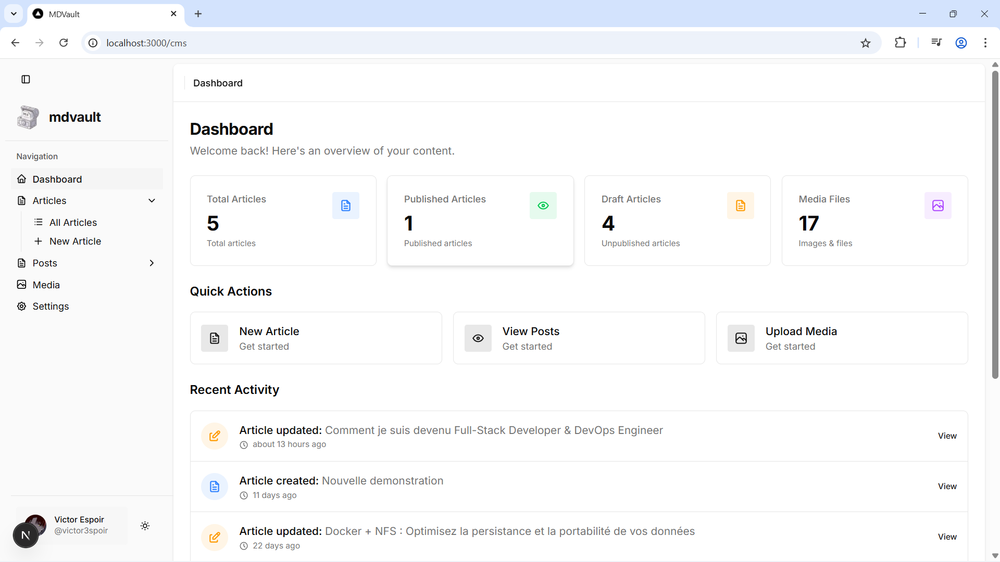
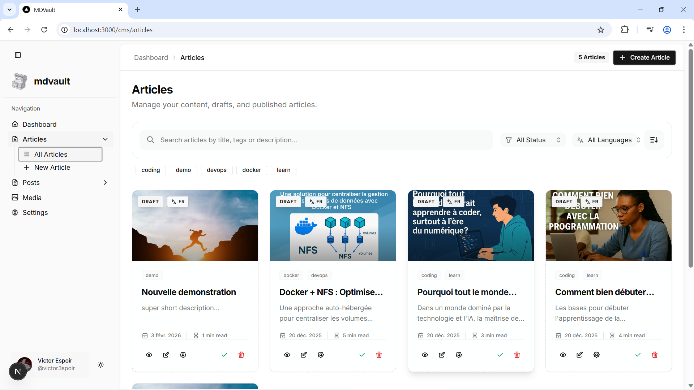
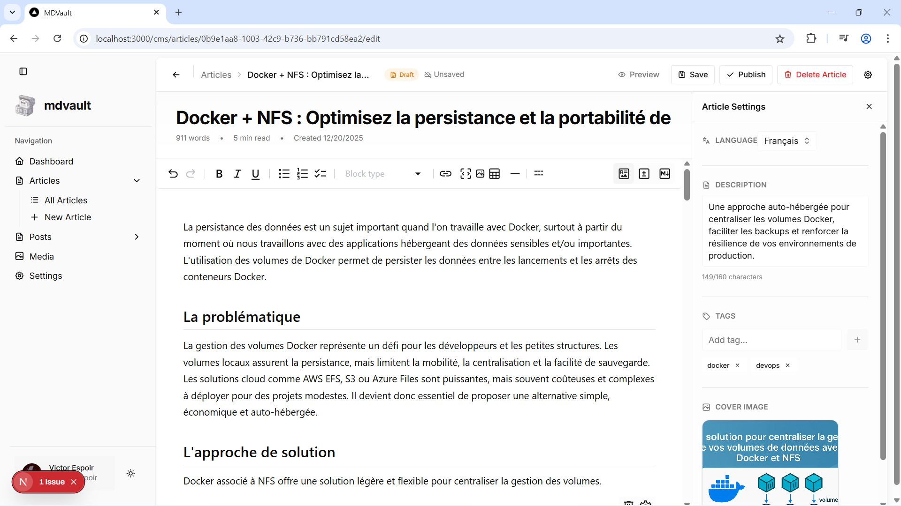
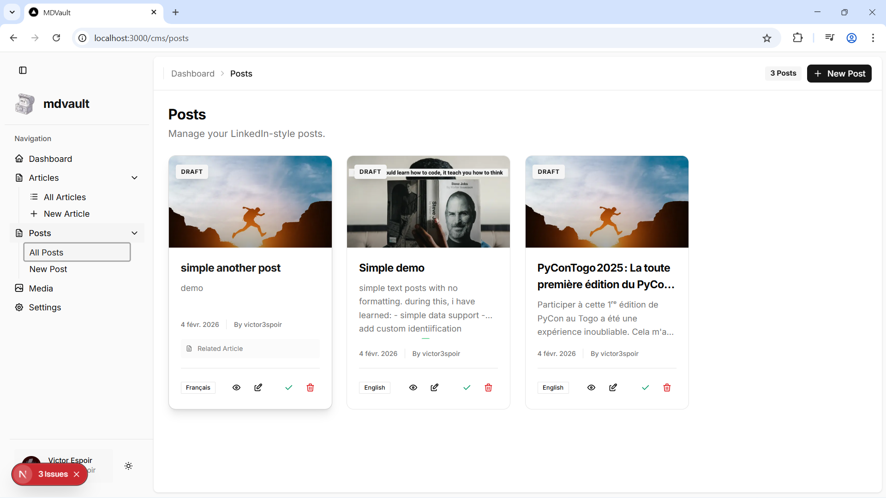
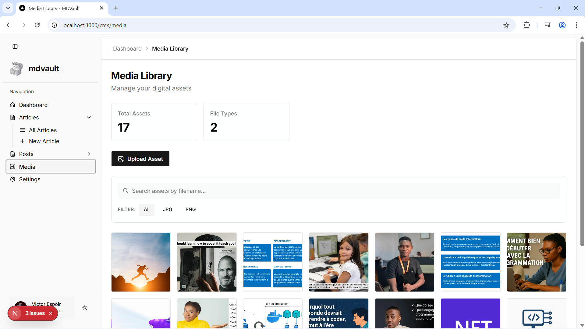

<div align="middle">

<h1>MDVault</h1>

GitHub-powered Markdown content management system. Create, edit, and manage your posts with a modern, intuitive interface.
</div>

## What is MDVault?

MDVault is a lightweight, developer-friendly CMS designed for managing Markdown-based content stored directly in GitHub repositories. It provides a clean web interface for writing, editing, and organizing posts & manage media without the complexity of traditional CMS platforms.

## Key Features

- **Markdown Editor**: Rich MDX editor with live preview and formatting tools
- **GitHub Integration**: Store all content in your GitHub repository as the single source of truth
- **Image Management**: Upload and organize images with built-in gallery and preview
- **Metadata Management**: Easily manage post titles, descriptions, slugs, tags, and cover images
- **Post Organization**: Browse, search, and manage all posts from a centralized dashboard
- **Draft & Publish**: Save drafts or publish posts directly from the editor

## Why Use MDVault?

- **Cost Effective**: No backend server costs - GitHub is your database
- **Version Control**: Full Git history of all content changes
- **Developer Friendly**: Built for developers who prefer working with Markdown
- **Privacy First**: Your content stays in your own GitHub repository
- **Simple Setup**: Minimal configuration required to get started
- **Modern UI**: Clean, responsive interface that works on desktop and tablet
- **Centralization**: All your assets are centralized in your repos for free.

## Screenshots

### Dashboard

Get an overview of all your content with the intuitive dashboard.


### Articles Management

Manage your articles with full control over metadata and content.


### Rich Markdown Editor

Write and edit content with the powerful MDX editor featuring live preview.


### Posts Management

Create and manage LinkedIn-style posts with ease.


### Media Gallery

Upload, organize, and manage all your images in one place.



## Getting Started

### Prerequisites

- Node.js 18+
- Bun or npm installed
- A GitHub repository for storing content
- GitHub Personal Access Token (for API authentication)

### Installation

1. Clone the repository:

```bash
git clone https://github.com/victor3spoir/mdvault.git
cd mdvault
```

1. Install dependencies:

```bash
bun install
# or
npm install
```

1. Set up environment variables:

```bash
cp .env.example .env.local
```

1. Configure your GitHub repository:
   - Add your GitHub token to `.env.local`
   - Specify your repository name for storing content

### Environment Variables

MDVault requires three environment variables to connect to your GitHub repository. Here's what each one means:

| Variable | Description | Example |
|----------|-------------|----------|
| `GITHUB_TOKEN` | A personal access token from GitHub for API authentication. [Create one here](https://github.com/settings/tokens). Must have `repo` scope to read/write content. | `ghp_16C7e42F292c6912E7...` |
| `GITHUB_OWNER` | Your GitHub username or organization name. Just the name, not a URL. | `victor3spoir` |
| `GITHUB_REPO` | The repository name where your content will be stored. Just the name, not a URL or full path. | `my-content-repo` |

**Example `.env.local`:**
```dotenv
GITHUB_TOKEN=ghp_16C7e42F292c6912E7...
GITHUB_OWNER=victor3spoir
GITHUB_REPO=my-content-repo
```

#### GitHub Token Permissions

When creating your personal access token, you need to grant the following permissions:

**For Fine-grained Personal Access tokens (Recommended):**
- Select your repository/ies as the resource owner
- Grant the following **Repository permissions**:
  - `contents`: **Read and write** - allows creating, updating, and deleting files
  - `metadata`: **Read-only** - grants read-only access to repository metadata

**For Classic Personal Access tokens:**
- Grant the **`repo`** scope - provides full control of private repositories
- This includes all permissions needed to read, write, and delete files

**Minimum Required Capabilities:**
- Create files (for saving new articles and media)
- Update files (for editing existing content)
- Delete files (for removing articles)
- Read repository contents
- Commit to the repository

For security best practices, use **fine-grained tokens** with specific repository access rather than classic tokens with broad permissions.

### Running the Development Server

```bash
bun dev
# or
npm run dev
```

Open [http://localhost:3000](http://localhost:3000) in your browser to see the application.

### Building for Production

```bash
bun run build
npm run start
```

### Running with Docker

MDVault is available as a containerized application. You can pull the image directly from GitHub Container Registry.

#### Using Docker Compose (Recommended)

1. Ensure you have a `compose.yml` file (or use the one provided in the repo):

```yaml
services:
  mdvault:
    image: ghcr.io/victor3spoir/mdvault:latest
    ports:
      - "3000:3000"
    environment:
      GITHUB_TOKEN: "your_personal_access_token"
      GITHUB_OWNER: "your_github_username"
      GITHUB_REPO: "your_content_repository"
    restart: unless-stopped
```

2. Start the container:
```bash
docker compose up -d
```

#### Using Docker CLI

```bash
docker pull ghcr.io/victor3spoir/mdvault:latest

docker run -d \
  -p 3000:3000 \
  -e GITHUB_TOKEN=your_token \
  -e GITHUB_OWNER=your_username \
  -e GITHUB_REPO=your_repo \
  ghcr.io/victor3spoir/mdvault:latest
```

## How It Works

1. **Connect GitHub**: MDVault connects to your GitHub repository using a personal access token
2. **Store Content**: All posts are stored as Markdown files in your repository
3. **Edit Online**: Use MDVault's web interface to create, edit, and organize content
4. **Version Control**: Every change is automatically committed to GitHub
5. **Deploy**: Push to production whenever your content is ready


## Architecture

- **Frontend**: Next.js 16 with React 19
- **Editor**: MDXEditor with live Markdown support
- **Backend**: GitHub API (Octokit) for content storage
- **Styling**: Tailwind CSS with shadcn/ui components
- **Icons**: Tabler Icons for consistent iconography

## Contributing

Contributions are welcome! Feel free to open issues or submit pull requests to help improve MDVault.

## License

MIT License - feel free to use this project for personal or commercial purposes.

Check out our [Next.js deployment documentation](https://nextjs.org/docs/app/building-your-application/deploying) for more details.
