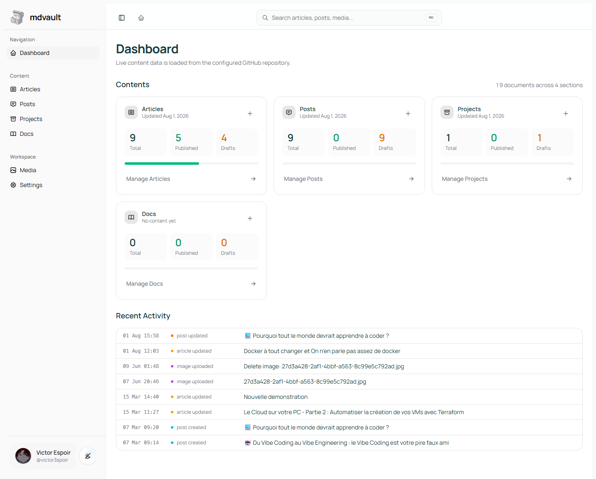
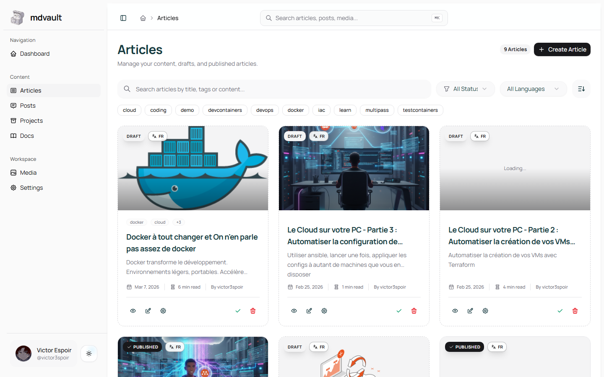
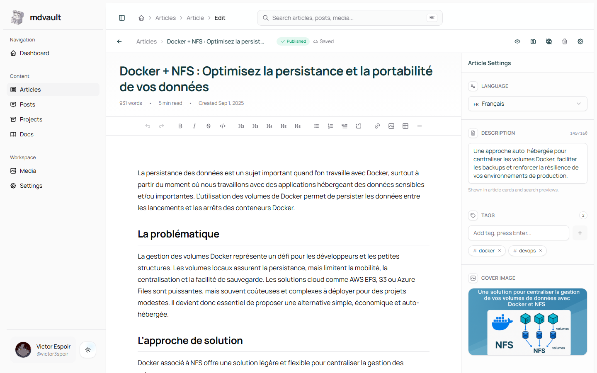
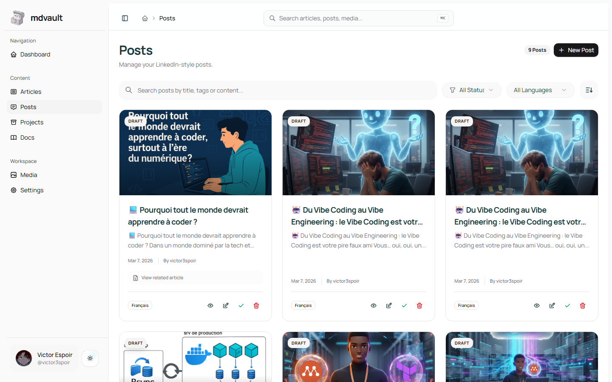
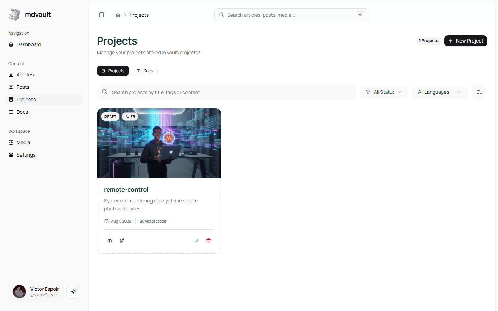
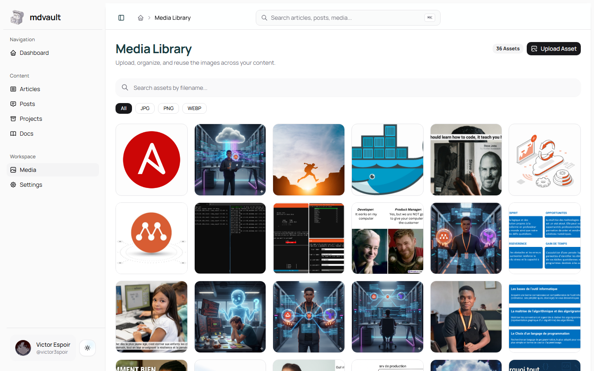
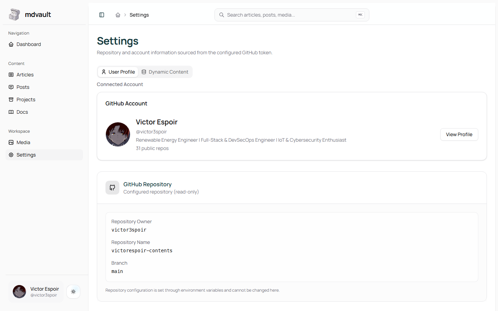
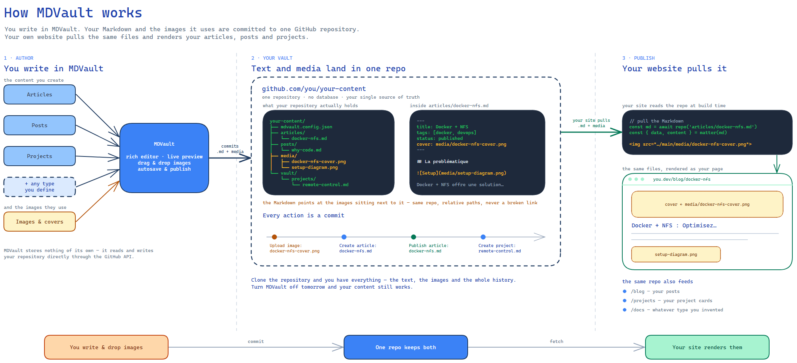

<div align="middle">

<h1>MDVault</h1>

**GitHub-powered Markdown content management.** Write, organize and publish your articles, posts and custom content types — **with the images they use** — versioned in your own repository.

<a href="https://mdvault-docs.vercel.app/">Website</a> ·
<a href="#quick-start">Quick start</a> ·
<a href="#features">Features</a>

<p>
<a href="https://github.com/victor3spoir/mdvault/releases"></a>
<a href="https://github.com/victor3spoir/mdvault/blob/main/LICENCE"></a>
<a href="https://github.com/victor3spoir/mdvault/pkgs/container/mdvault"></a>
<a href="https://github.com/victor3spoir/mdvault/stargazers"></a>
<a href="https://github.com/victor3spoir/mdvault/commits"></a>
</p>
</div>



## What is MDVault?

Developers keep their content in Git — but editing raw Markdown files, uploading images somewhere else and wiring their paths by hand is tedious. MDVault manages the **whole content bundle**: the Markdown, its frontmatter, *and* every image it references — committed side by side in the same repository.

- **Text and media together.** Images dropped into the editor are optimized, committed to the repo and linked by relative path. Clone the repository and nothing is missing — no external asset host, no broken links.
- **No database.** The repository *is* the database.
- **No lock-in.** Plain Markdown with YAML frontmatter, readable by any static site generator.
- **Full history.** Every create, update, publish or delete is a commit.

## Quick start

You need a GitHub repository for your content and a personal access token that can write to it ([permissions below](#github-token-permissions)).

MDVault is published to GitHub Container Registry. Bind it to loopback so it is only reachable from your machine:

```bash
docker run -d \
  --name mdvault \
  -p 127.0.0.1:3000:3000 \
  -e GITHUB_TOKEN=your_token \
  -e GITHUB_OWNER=your_username \
  -e GITHUB_REPO=your_repo \
  --restart unless-stopped \
  ghcr.io/victor3spoir/mdvault:latest
```

<details>
<summary>Or with Docker Compose</summary>

```yaml
services:
  mdvault:
    image: ghcr.io/victor3spoir/mdvault:latest
    ports:
      - "127.0.0.1:3000:3000"
    environment:
      GITHUB_TOKEN: "your_personal_access_token"
      GITHUB_OWNER: "your_github_username"
      GITHUB_REPO: "your_content_repository"
    restart: unless-stopped
```

```bash
docker compose up -d
```

</details>

Open **http://127.0.0.1:3000** and start writing — or go to **Settings → Dynamic Content** to define your own content types.

> Prefer to run it from source? See [Development](#development). Full configuration is in [Configuration](#configuration).

## Features

| | |
|---|---|
| **Rich WYSIWYG editor** | Tiptap-based editor with headings, lists, quotes, links, tables, images and code blocks — everything round-trips to clean Markdown |
| **Text & media in one repo** | Images uploaded from the editor are optimized, committed alongside your Markdown and referenced by relative path |
| **Custom content types** | Declare new asset types in Settings; folders are created in the repo, sidebar links appear instantly, and each type picks its own editor |
| **Live split preview** | Write on the left, see the published rendering on the right — same renderer and syntax colors as the final page |
| **Autosave & drafts** | Local drafts survive refreshes and crashes, with publish/unpublish controls in every editor and content card |
| **Command palette** | <kbd>⌘</kbd>/<kbd>Ctrl</kbd> + <kbd>K</kbd> to jump to any article, post or custom asset, or start a new one |
| **Media library** | Drag-and-drop uploads with automatic image optimization, one-click URL/Markdown copy, and usage checks before deleting |
| **Image controls in-editor** | Resize (25–100%), align left/center/right, alt text and captions — persisted inside plain Markdown |
| **Syntax highlighting** | Code highlighted while typing and in output, 20+ languages with a per-block language picker |
| **Search & filters** | Shared search, status, language, tag filters and sorting across every content list, with state in the URL |
| **Plain-text posts** | Short-form content uses a text-only editor schema, so posts stay plain by design — and can point at the article they promote |
| **Light & dark themes** | The whole workspace, editor and preview follow your theme choice |
| **Table editing** | Floating menu to insert/delete rows and columns, toggle headers, merge and split cells |
| **Private media rendering** | Images from private repos are fetched server-side and cached, so previews work without exposing your token |
| **Git-native storage** | Descriptive commit messages and SHA-based conflict detection, so concurrent edits never silently overwrite |

## Screenshots

### Dashboard
Metrics per content section — articles, posts and every custom type you define — plus a log of the commits MDVault made for you.


### Articles
Cards with cover, status, tags and inline publish, edit and delete actions — with shared search, status, language and tag filters.


### Editor
Distraction-free writing surface with word count, read time and save status, plus a collapsible settings sidebar for language, description, tags and cover image.


### Posts
Short-form, plain-text content — enforced by the schema, not by disabled buttons — that can reference a related article.


### Custom content types (Vault)
Your own types, each with its own list, editor and repository folder under `vault/`.


### Media library
Upload, filter and reuse images across your content, with usage checks before deleting.


### Settings
Connected GitHub account, repository info, and the asset types manager where new content types are defined.


## How it works



1. **Point it at a repository** — provide a GitHub token, owner and repo name. MDVault reads and writes through the GitHub API; there is no other data store.
2. **Write and upload in the browser** — content is edited as rich text and serialized to Markdown with YAML frontmatter. Images dropped into the editor are optimized, uploaded to the repository's media folder and linked by relative path.
3. **Every action is a commit** — saving, publishing or deleting commits the file with a descriptive message. File SHAs guard against concurrent overwrites.
4. **Your site consumes the repo** — your static site or app reads the same Markdown files *and the same image files* straight from Git.

```
your-content-repo/
├── mdvault.config.json     # asset types you defined
├── articles/               # long-form content (.md)
├── posts/                  # short-form content (.md)
├── media/                  # images, committed alongside
└── vault/
    ├── projects/           # custom type
    └── docs/               # custom type
```

## Configuration

### Environment variables

| Variable | Description | Default |
|----------|-------------|---------|
| `GITHUB_TOKEN` | Token used by the server to read and write repository content | Required |
| `GITHUB_OWNER` | User or organization that owns the content repository | Required |
| `GITHUB_REPO` | Content repository name, without owner or URL | Required |
| `ARTICLES_PATH` | Directory containing articles | `articles` |
| `POSTS_PATH` | Directory containing posts | `posts` |
| `MEDIA_PATH` | Directory containing media files | `media` |

Custom content types are stored under `vault/<type>/` and configured through `mdvault.config.json` at the repository root — created and managed from the Settings UI.

For local development, create `mdvault/.env.local`:

```dotenv
GITHUB_TOKEN=<your_github_token>
GITHUB_OWNER=victor3spoir
GITHUB_REPO=my-content-repo

# Optional
ARTICLES_PATH=articles
POSTS_PATH=posts
MEDIA_PATH=media
```

### GitHub token permissions

Fine-grained personal access tokens are recommended. Limit the token to the content repository and grant:

- **Contents:** Read and write
- **Metadata:** Read-only

A classic token needs the broader `repo` scope for private repositories.

### Security model

MDVault deliberately has **no application login, user accounts, or in-app authentication**. `GITHUB_TOKEN` is a server-side credential for GitHub API operations; it does not authenticate people accessing the interface.

Access control is a deployment responsibility. Run MDVault only on a trusted network or place it behind firewall, VPN, or reverse-proxy access controls. Do not expose it directly to the public internet.

## Development

The application lives in `mdvault/` and uses Bun as its primary package manager and runtime.

```bash
git clone https://github.com/victor3spoir/mdvault.git mdvault-repo
cd mdvault-repo/mdvault
bun install --frozen-lockfile
```

After creating `.env.local`:

```bash
bun run dev             # Development server on port 3000
bun run check           # Biome checks
bun run typecheck       # TypeScript typecheck
bun run test            # Vitest test suite
bun run build           # Production build
```

Nitro writes the deployable server to `.output/server/index.mjs`:

```bash
HOST=127.0.0.1 PORT=3000 bun .output/server/index.mjs
```

## Architecture

- **Framework:** TanStack Start with React 19
- **Routing & SSR:** TanStack Router with file-based routes
- **Server state:** TanStack Query with router SSR integration
- **Build & runtime:** Vite and Nitro, producing a Node-compatible server in `.output/`
- **Content storage:** GitHub API through Octokit
- **Editor:** Tiptap (rich) and a minimal plain-text editor, both serializing Markdown
- **Rendering & highlighting:** TanStack Markdown and TanStack Highlight
- **Styling:** Tailwind CSS v4 with shadcn/ui components

## Documentation site

The presentation site is live at **[mdvault-docs.vercel.app](https://mdvault-docs.vercel.app/)** and lives in [`docs/`](./docs). It deploys to Vercel with the project's **Root Directory** set to `docs`; everything else is read from `docs/vercel.json`. See [`docs/README.md`](./docs/README.md) for details.

## Contributing

Before opening a pull request, run:

```bash
bun run check
bun run typecheck
bun run test
bun run build
```

## License

MIT License - feel free to use this project for personal or commercial purposes.
