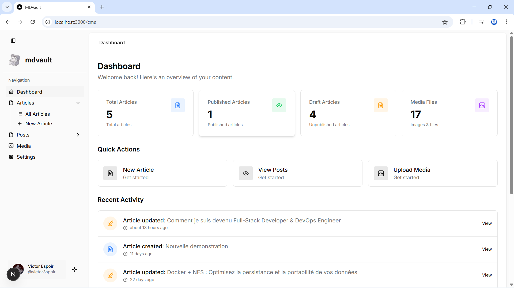
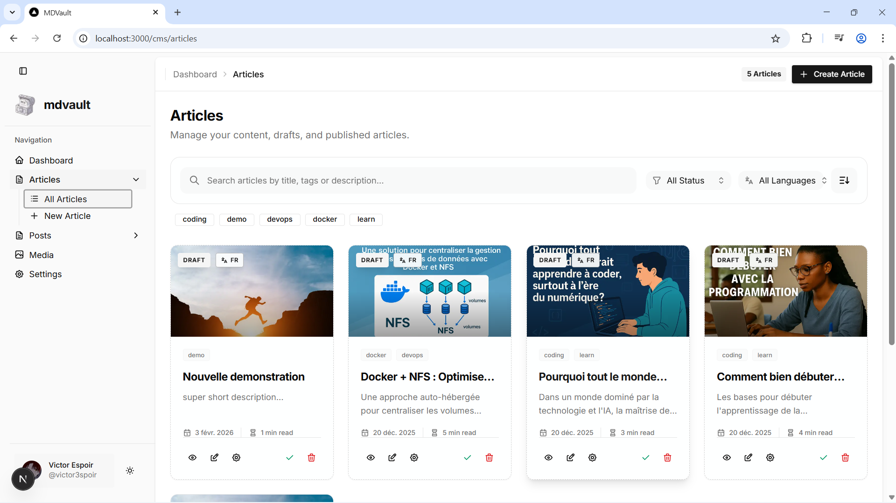
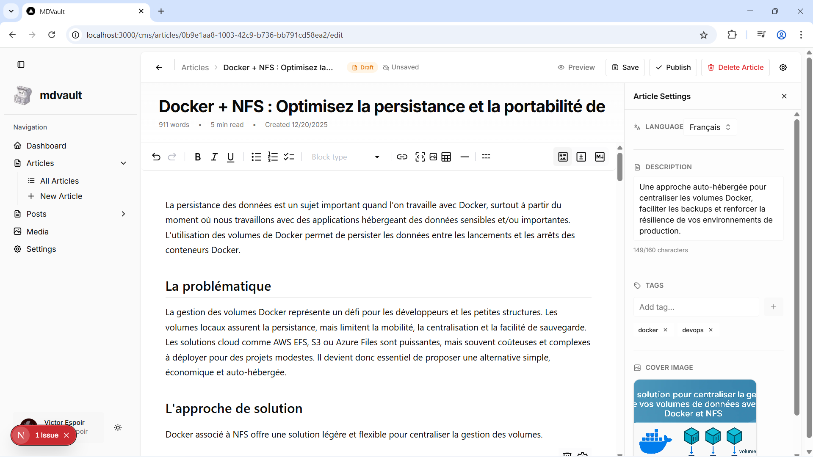
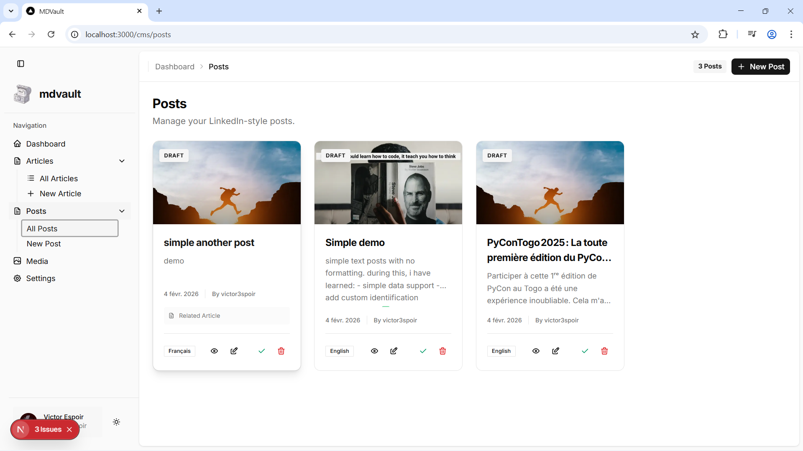
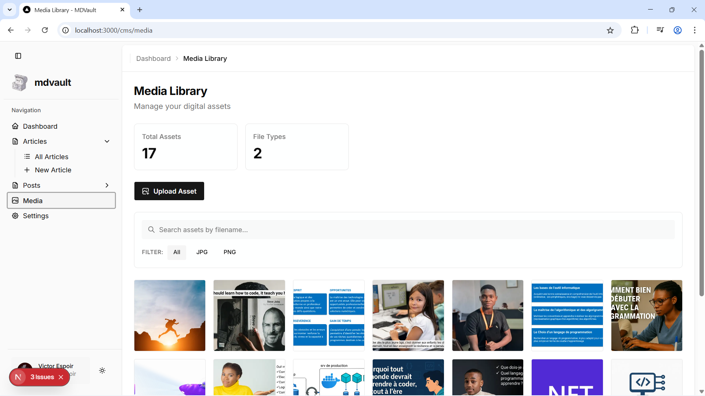

<div align="middle">

<h1>MDVault</h1>

GitHub-powered Markdown content management system. Create, edit, and manage your posts with a modern, intuitive interface.
</div>

## What is MDVault?

MDVault is a lightweight, developer-friendly CMS designed for managing Markdown-based content stored directly in GitHub repositories. It provides a clean web interface for writing, editing, and organizing posts & manage media without the complexity of traditional CMS platforms.

## Key Features

- **Markdown Editor**: Rich MDX editor with live preview and formatting tools
- **GitHub Integration**: Store all content in your GitHub repository as the single source of truth
- **Image Management**: Upload and organize images with built-in gallery and preview
- **Metadata Management**: Easily manage post titles, descriptions, slugs, tags, and cover images
- **Post Organization**: Browse, search, and manage all posts from a centralized dashboard
- **Draft & Publish**: Save drafts or publish posts directly from the editor

## Why Use MDVault?

- **Cost Effective**: No backend server costs - GitHub is your database
- **Version Control**: Full Git history of all content changes
- **Developer Friendly**: Built for developers who prefer working with Markdown
- **Privacy First**: Your content stays in your own GitHub repository
- **Simple Setup**: Minimal configuration required to get started
- **Modern UI**: Clean, responsive interface that works on desktop and tablet
- **Centralization**: All your assets are centralized in your repos for free.

## Screenshots

### Dashboard

Get an overview of all your content with the intuitive dashboard.


### Articles Management

Manage your articles with full control over metadata and content.


### Rich Markdown Editor

Write and edit content with the powerful MDX editor featuring live preview.


### Posts Management

Create and manage LinkedIn-style posts with ease.


### Media Gallery

Upload, organize, and manage all your images in one place.


## Getting Started

### Prerequisites

- A GitHub repository for storing content
- A GitHub personal access token with read/write access to that repository
- Docker and Docker Compose for container deployment, or Bun for local development

### Quick Start with Docker

MDVault is published to GitHub Container Registry. Bind the container to loopback by default so it is reachable only from the host:

```yaml
services:
  mdvault:
    image: ghcr.io/victor3spoir/mdvault:latest
    ports:
      - "127.0.0.1:3000:3000"
    environment:
      GITHUB_TOKEN: "your_personal_access_token"
      GITHUB_OWNER: "your_github_username"
      GITHUB_REPO: "your_content_repository"
    restart: unless-stopped
```

Start it with:

```bash
docker compose up -d
```

Or use Docker directly:

```bash
docker pull ghcr.io/victor3spoir/mdvault:latest

docker run -d \
  --name mdvault \
  -p 127.0.0.1:3000:3000 \
  -e GITHUB_TOKEN=your_token \
  -e GITHUB_OWNER=your_username \
  -e GITHUB_REPO=your_repo \
  --restart unless-stopped \
  ghcr.io/victor3spoir/mdvault:latest
```

Open [http://127.0.0.1:3000](http://127.0.0.1:3000). Keep the loopback binding when a reverse proxy on the same host provides controlled access.

### Environment Variables

MDVault uses the configured GitHub token as its only GitHub API credential.

| Variable | Description | Default |
|----------|-------------|---------|
| `GITHUB_TOKEN` | GitHub personal access token used by the server to read and write repository content. | Required |
| `GITHUB_OWNER` | GitHub user or organization that owns the content repository. | Required |
| `GITHUB_REPO` | Content repository name, without an owner or URL. | Required |
| `ARTICLES_PATH` | Directory containing articles. | `articles` |
| `POSTS_PATH` | Directory containing posts. | `posts` |
| `MEDIA_PATH` | Directory containing media files. | `media` |

For local development, create `mdvault/.env.local`:

```dotenv
GITHUB_TOKEN=<your_github_token>
GITHUB_OWNER=victor3spoir
GITHUB_REPO=my-content-repo

# Optional
ARTICLES_PATH=articles
POSTS_PATH=posts
MEDIA_PATH=media
```

#### GitHub Token Permissions

Fine-grained personal access tokens are recommended. Limit the token to the content repository and grant:

- **Contents:** Read and write
- **Metadata:** Read-only

A classic token needs the broader `repo` scope for private repositories. The required capabilities are reading, creating, updating, and deleting repository files and creating the corresponding commits.

### Security Model

MDVault deliberately has **no application login, user accounts, or in-app authentication**. `GITHUB_TOKEN` is a server-side credential for GitHub API operations; it does not authenticate people accessing the MDVault interface.

Access control is a deployment responsibility. Run MDVault only on a trusted network or place it behind firewall, VPN, or reverse-proxy access controls. Do not expose the application directly to the public internet.

## Development

The application lives in `mdvault/` and uses Bun as its primary package manager and runtime.

```bash
git clone https://github.com/victor3spoir/mdvault.git mdvault-repo
cd mdvault-repo/mdvault
bun install --frozen-lockfile
```

After creating `.env.local`, use these commands:

```bash
bun run dev             # Development server on port 3000
bun run check           # Biome checks
bun run typecheck       # TypeScript typecheck
bun run test            # Vitest test suite
bun run build           # Production build
```

To inspect a production build through Vite's preview server:

```bash
bun run preview
```

Nitro writes the deployable server to `.output/server/index.mjs`. Run that output directly for production:

```bash
HOST=127.0.0.1 PORT=3000 bun .output/server/index.mjs
```

The Docker image sets its internal host to `0.0.0.0` so Docker can route traffic to it; the host-side port mapping remains loopback-only by default.

## Architecture

- **Application framework:** TanStack Start with React 19
- **Routing and SSR:** TanStack Router with file-based routes
- **Server state:** TanStack Query with router SSR integration
- **Build and server runtime:** Vite and Nitro, producing a Node-compatible server in `.output/`
- **Content storage:** GitHub API through Octokit
- **Editor:** MDXEditor with live Markdown support
- **Styling:** Tailwind CSS with shadcn/ui components

## Contributing

Before opening a pull request, run:

```bash
bun run check
bun run typecheck
bun run test
bun run build
```

## License

MIT License - feel free to use this project for personal or commercial purposes.
