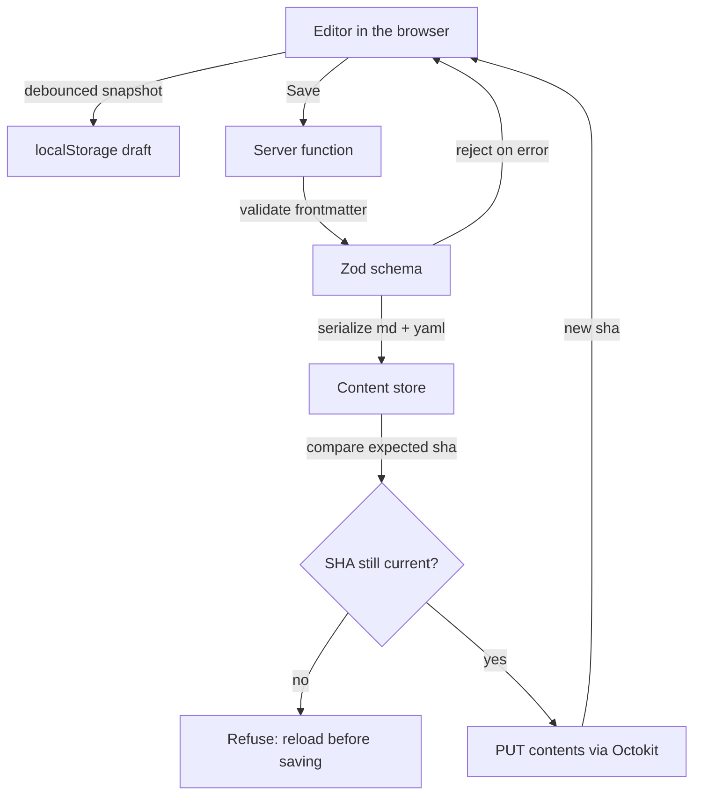

MDVault has one storage backend: your GitHub repository. There is no database,
no object store and no cache to warm. Every piece of content is a file, every
save is a commit, and the history you get for free is Git's.

## The write path



Three things are worth pulling out of that diagram.

**The local draft is not a save.** It protects against a closed tab. Nothing
reaches GitHub until you press Save.

**Validation happens before serialization.** A title over 200 characters or an
eleventh tag is refused with the reason, so the repository never receives a file
that MDVault cannot read back.

**Concurrency is detected, not merged.** Each document is loaded with the blob
SHA it had at the time. On save, that SHA must still be current. If it is not —
someone edited the file in GitHub, or in another tab — the write is refused with
"changed in GitHub, reload it before saving again". Merging Markdown
automatically would silently lose a paragraph; refusing loses nothing.

## The read path

Lists are fetched server-side and hydrated into TanStack Query on the client, so
the first paint has content and later navigation is served from cache. Filtering
and sorting happen in the browser over the already-fetched list, which is why
the filters are instant and live in the URL.

Content-heavy pages are rendered from the Markdown body at request time; there
is no build step between writing and seeing.

## Commit messages

MDVault writes messages a human can scan in `git log`:

```
Create article: Deploying with Docker
Update article: Deploying with Docker
Publish post: Release 1.4 is out
Unpublish article: Draft experiment
Delete post: release-1-3
```

The noun matches the content kind, so filtering history by type is a `git log
--grep` away.

## The stack

| Layer | Choice |
|---|---|
| Framework | TanStack Start with React 19 |
| Routing | TanStack Router, file-based |
| Data | TanStack Query with SSR hydration |
| Build | Vite, Nitro output |
| GitHub | Octokit REST |
| Editor | Tiptap for rich text, textarea for plain |
| Styling | Tailwind v4 with shadcn components |
| Tooling | bun, Biome, Vitest |

## What this buys you

Backups are `git clone`. Rollback is `git revert`. Reviewing what changed is
`git diff`. Migrating away is copying a folder. The cost is that GitHub's API is
in the hot path for every read — which is why the media endpoint caches
aggressively and lists are fetched once and filtered locally.
