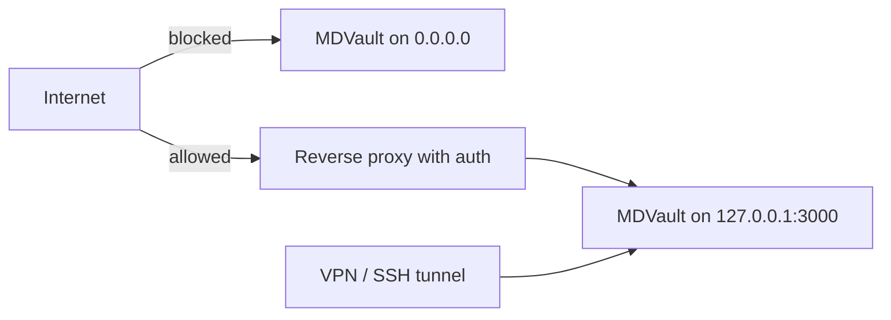

The single most important fact: **MDVault has no authentication of its own.**
Anyone who can reach the interface can write to your repository with your token.
Access control is a deployment decision, and it is yours.

## Deploying it safely

Pick one:

- **Loopback only.** Bind to `127.0.0.1:3000`, reach it over an SSH tunnel or a
  VPN. This is the default in the shipped Compose file, which binds
  `127.0.0.1:33000:3000`.
- **Behind a proxy that authenticates.** Basic auth, an OAuth forward-auth
  service, or your identity provider — anything that refuses unauthenticated
  requests before they reach the app.

Do not publish it on a public port and hope the URL stays secret.

## The token is the blast radius

MDVault acts as one GitHub identity. A fine-grained token scoped to a single
repository with `Contents: read and write` limits the damage to that repository.
A classic `repo` token exposes everything you own. Use fine-grained — see
[GitHub token](/getting-started/github-token).

The token never reaches the browser. Private-repository images are fetched
server-side and re-served through `/api/media`, which exists partly for this
reason.

## What the app does protect

Even without a login, MDVault defends against the abuse it can see.

**Rate limiting.** Per client, per 60-second window: 300 reads and 20 writes.
Up to 10 000 clients are tracked. Exceeding the limit returns `429` with
`Retry-After`. This protects your GitHub API quota as much as the server.

**Trusted origin on writes.** Write methods require `Sec-Fetch-Site` to be
`same-origin` or `none`, and an `Origin` header matching the deployment. A form
on another site cannot post into your instance.

**CSRF tokens** are issued and verified for mutating requests.

**Body size cap** of 8 MiB, which bounds an upload before it reaches memory.

**Client identity.** `X-Forwarded-For` is honoured **only** when
`TRUSTED_PROXY=true`. Behind a proxy you configured, set it, otherwise every
client looks like the proxy and shares one quota. Exposed directly, leave it
unset, or a client can spoof the header and give itself an unlimited quota.

**Path validation.** Absolute paths, `..`, `.` and NUL bytes are rejected;
identifiers must match `^[A-Za-z0-9][A-Za-z0-9._-]*$`; media files must sit
exactly one level under the media root.

**SVG sanitisation** on upload, because an SVG can carry script and is served
with the same origin as the app.

## Checklist before exposing it

1. Fine-grained token, one repository, `Contents: read and write`.
2. Bound to loopback, or behind an authenticating proxy.
3. `SERVER_URL` set to the real public origin.
4. `TRUSTED_PROXY=true` **only** if a proxy you control sets the header.
5. Container resource limits in place — the shipped Compose file uses 0.7 CPU
   and 800 MiB.
