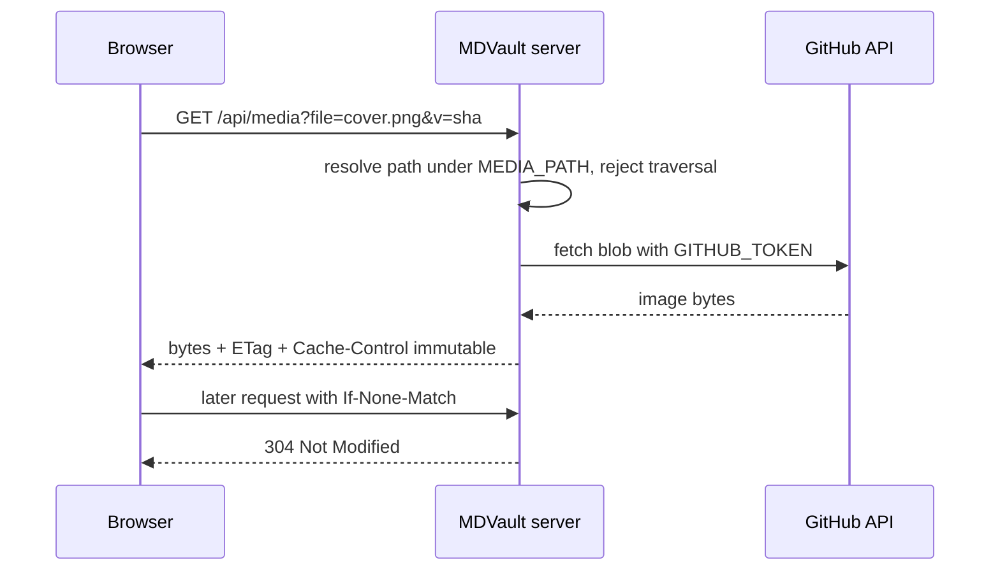

Images live in `media/` (or `MEDIA_PATH`), next to the Markdown that uses them.
There is no CDN account to create and no asset host to migrate away from:
cloning the repository gets you the pictures too.


## Uploading

Drop files into the media library, or insert them straight from the editor.
Before anything is uploaded, the browser compresses the image:

- GIF, AVIF and SVG are left alone — re-encoding them loses animation or
  vectors.
- JPEG becomes WebP; PNG is tried as both WebP and PNG, and the smaller wins.
- Anything larger than 2560 px on its longest side is downscaled.
- Quality is attempted at 0.92, then 0.86, then 0.80.
- The result is kept **only if it is at least 15 % smaller** than the original.
  Otherwise your file is uploaded untouched.

Compression happens client-side, so the server never handles the original
multi-megabyte file.

## Serving

Images are not linked directly to GitHub. They are requested from the app:

```
/api/media?file=cover.png&v=<sha>&w=800
```



Two reasons for the indirection. First, **the token stays on the server** — a
private repository's images would otherwise be unreachable from the browser, or
would leak the credential. Second, it gives the app a place to set caching and
resize.

| Parameter | Effect |
|---|---|
| `file` | Filename only, no folders. Required |
| `v` | Any version marker, usually the blob SHA. Makes the response `immutable` for a year |
| `w` | Target width; returns a downscaled WebP |

Without `v`, the response is cached for 60 seconds with a week of
`stale-while-revalidate` — fresh enough that replacing an image shows up
quickly, cheap enough that a gallery does not hammer the GitHub API.

The filename is a query parameter rather than a path segment because a URL
ending in `.png` is claimed by the static-asset middleware before the router
sees it.

Full status codes are listed in [HTTP endpoints](/docs/reference/http-endpoints).

Building the same proxy in your own app is covered step by step in
[Serve private images](/docs/guides/serve-private-images).

## Sizing and alignment

Width and alignment chosen in the editor are stored in the Markdown link's
fragment:

```markdown

```

Widths are limited to 25, 50, 75 and 100 percent, alignment to `left`,
`center`, `right`. The fragment is not part of the repository path, so the
image still resolves after a round-trip through any other Markdown tool — and a
renderer that ignores fragments simply shows the image full width.

## Path safety

A media file must sit exactly one level under the media root. Absolute paths,
`..`, `.` and NUL bytes are rejected, and filenames must match
`^[A-Za-z0-9][A-Za-z0-9._-]*$`. A crafted `file` parameter cannot reach the
rest of the repository.

SVG uploads are sanitised before being stored, since an SVG can carry script.
