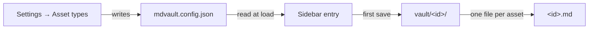

Articles and posts cover most needs. The vault covers the rest: it lets you
declare content types of your own — projects, recipes, lab notes, bookmarks —
each with its own folder, icon and editor.

A type called "Projects" gets its own sidebar entry, its own list, and its own
folder in the repository — none of which required touching the code:


## Declaring a type

**Settings → Asset types** writes `mdvault.config.json` at the root of your
repository:


```json
{
  "version": 1,
  "assetTypes": [
    { "id": "projects", "label": "Projects", "icon": "folder", "editor": "rich" },
    { "id": "notes", "label": "Field notes", "icon": "flask", "editor": "plain" }
  ]
}
```

| Field | Rule |
|---|---|
| `id` | `^[a-z][a-z0-9-]*$`, 2–30 characters. Becomes the folder name and a URL segment |
| `label` | Up to 40 characters, shown in the sidebar |
| `icon` | One of the twelve icons below |
| `editor` | `rich` for WYSIWYG, `plain` for text |

Available icons: `note`, `book`, `school`, `bulb`, `checklist`, `bookmark`,
`folder`, `flask`, `code`, `pencil`, `star`, `archive`. An unknown value falls
back to `note` rather than breaking the page.

Ids must be unique, cannot exceed twenty types, and cannot use a reserved word:
`articles`, `posts`, `media`, `settings`, `vault`, `new`, `edit`, `cms` — each
of those already names a route.

## Where the content goes

Assets of a type live in `vault/<id>/`. A type declared as `projects` stores
`vault/projects/my-first-project.md`. The folder is created on first save, so
declaring a type you never use costs nothing.



## Frontmatter

A vault asset carries the same fields as an article — title, description,
published, lang, author, tags, coverImage, dates — plus `type`, which repeats
the type id. It has no `translationKey`: translation grouping is an article
feature.

## Renaming and deleting a type

Changing an `id` does **not** move files. The old folder stays in Git,
untouched and invisible in the interface, and the new one starts empty. Move
the files yourself in a commit if that is what you meant. Changing only the
`label` or the `icon` is safe — those are display concerns.

Deleting a type removes it from the sidebar. The content remains in the
repository, which is the point of storing everything in Git.
