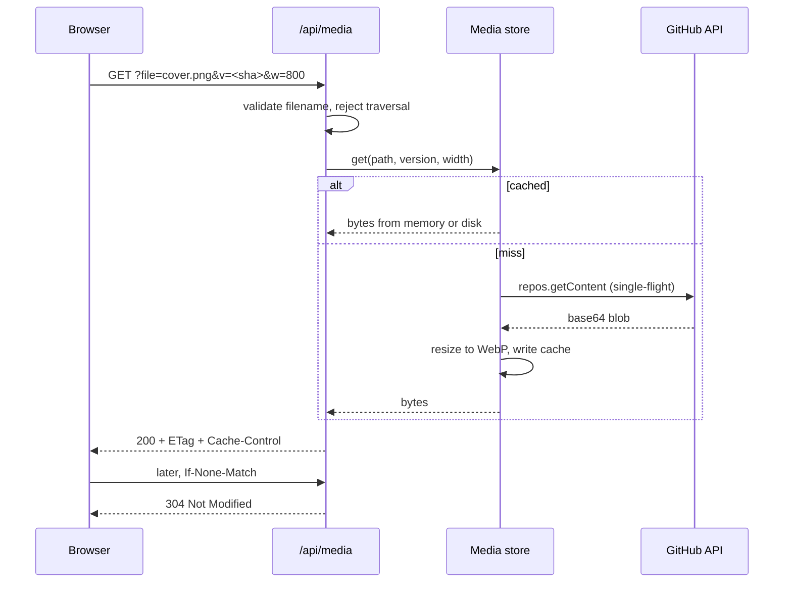

Markdown written in MDVault references images as repository paths —
`media/cover.png`. In a private repository those bytes are unreachable from a
browser: fetching them needs a token, and a token cannot go to the client. The
fix is a proxy endpoint on your own server. This page is MDVault's own
implementation, generalised.

## First: do you need a proxy at all?

| Your situation | What to do |
|---|---|
| Static site, content cloned in CI | Copy `media/` into the build output and rewrite paths. No proxy, no token in production |
| Dynamic app, private repository | Build the proxy described below |
| Public repository | Rewrite to `raw.githubusercontent.com` and let the CDN do the work |

Only the middle row justifies the rest of this page. Building a runtime proxy
for a site that could have copied the files at build time is a cache, a token
and a failure mode you did not need.

## The shape



Four pieces: a URL helper on the client, a validated route, a cache, and a
GitHub reader. Each one is small; the value is in the details.

## 1. The client helper

The renderer sees `media/cover.png#w=50&align=left`. Turn that into a URL:

```ts
const VALID_WIDTHS = new Set([25, 50, 75, 100]);
const VALID_ALIGNS = new Set(["left", "center", "right"]);

export function splitImageSource(source: string) {
	const [path, fragment = ""] = source.split("#");
	const params = new URLSearchParams(fragment);
	const width = Number(params.get("w"));
	const align = params.get("align") ?? "";

	return {
		path,
		width: VALID_WIDTHS.has(width) ? width : 100,
		align: VALID_ALIGNS.has(align) ? align : "center",
	};
}

export function mediaUrl(source: string, options: { version?: string; width?: number } = {}) {
	if (/^(https?:|data:)/.test(source)) return source;

	const { path } = splitImageSource(source);
	const file = path.split("/").pop();
	if (!file) return undefined;

	const query = new URLSearchParams({ file });
	if (options.version) query.set("v", options.version);
	if (options.width) query.set("w", String(options.width));

	return `/api/media?${query.toString()}`;
}
```

`w` in the fragment is a **percentage** for layout; `w` in the query is a
**pixel width** for the resizer. They are unrelated, and conflating them is the
first bug everyone writes.

Then a component that degrades quietly rather than showing a broken-image icon:

```tsx
export function PrivateImage({ src, alt, version, width, priority }: Props) {
	const url = mediaUrl(src, { version, width });
	if (!url) return <div className="bg-muted rounded-md" aria-hidden />;

	return (
		
	);
}
```

## 2. The route

```ts
export const ServerRoute = createFileRoute("/api/media")({
	server: {
		handlers: {
			GET: async ({ request }) => {
				const url = new URL(request.url);
				const file = url.searchParams.get("file");
				if (!file) return new Response("missing file", { status: 400 });

				const path = resolveMediaPath(file);
				if (!path) return new Response("not found", { status: 404 });

				const version = url.searchParams.get("v") ?? undefined;
				const width = parseWidth(url.searchParams.get("w"));
				const result = await mediaStore.get(path, version, width);

				if (result.kind === "not-found") return new Response(null, { status: 404 });
				if (result.kind === "rate-limited") {
					return new Response(null, {
						status: 429,
						headers: { "retry-after": String(result.retryAfter ?? 60) },
					});
				}
				if (result.kind === "error") return new Response(null, { status: 502 });

				if (request.headers.get("if-none-match") === result.etag) {
					return new Response(null, { status: 304 });
				}

				return new Response(result.bytes, {
					headers: {
						"content-type": result.contentType,
						"content-length": String(result.bytes.byteLength),
						etag: result.etag,
						"cache-control": version
							? "public, max-age=31536000, immutable"
							: "public, max-age=60, stale-while-revalidate=604800",
						"x-content-type-options": "nosniff",
					},
				});
			},
		},
	},
});
```

`immutable` for a year is safe **only** because the version is the image's own
blob SHA and MDVault never rewrites a file in place — uploads get a fresh UUID
filename. Without `v`, a minute of freshness plus a week of
`stale-while-revalidate` keeps a gallery off the GitHub API without making a
replaced image linger.

Use the **document's** SHA as the version and every image on the page busts its
cache on every edit. Use the **blob's** SHA and nothing re-downloads until the
bytes actually change.

## 3. Path validation

The `file` parameter is attacker-controlled. Decode it, normalise separators,
and reject anything that could climb:

```ts
export function pathSegments(input: string) {
	const decoded = decodeURIComponent(input).replace(/\\/g, "/");
	if (decoded.startsWith("/") || decoded.includes("\0")) return undefined;

	const segments = decoded.split("/").filter(Boolean);
	if (segments.some((segment) => segment === "." || segment === "..")) return undefined;

	return segments;
}
```

Then require **exactly one segment** under the media root, and match the name
against `^[A-Za-z0-9][A-Za-z0-9._-]*$`. A media file is a flat filename; any
request with a folder in it is either a bug or an attack, and both deserve a
404.

## 4. The cache

A cache here is not an optimisation, it is what makes the endpoint viable — the
GitHub API is rate limited and slow enough to be visible. Three behaviours
matter more than the storage:

**Single-flight.** A gallery of forty images mounting at once must produce one
upstream fetch per distinct image, not forty. Key an in-flight map by the cache
key and hand every caller the same promise.

```ts
const inFlight = new Map<string, Promise<Entry>>();

function load(key: string, fetcher: () => Promise<Entry>) {
	const existing = inFlight.get(key);
	if (existing) return existing;

	const promise = fetcher().finally(() => inFlight.delete(key));
	inFlight.set(key, promise);
	return promise;
}
```

**Stale-on-error.** When GitHub returns 429 or 502 and you hold a stale copy,
serve it. A slightly old image beats a broken page, and the alternative is a
thundering herd exactly when the upstream is unhappy.

**Bounded concurrency and backoff.** Six simultaneous upstream fetches is a
reasonable ceiling; retry with `Math.max(retryAfter * 1000, 2 ** attempt * 250)`
so an explicit `Retry-After` always wins over your own guess.

Two layers, memory then disk, both keyed by a hash of path plus version.
Versioned entries never revalidate — the key already encodes the content.
Unversioned entries carry a short TTL. Disk-write failures are swallowed: a
read-only filesystem should degrade to a memory cache, not to a 500.

## 5. Reading the blob

```ts
const { data } = await octokit.repos.getContent({ owner, repo, path });

if (Array.isArray(data) || data.type !== "file") return { kind: "not-found" };

let base64 = data.content;
if (!base64) {
	// Blobs over ~1 MB come back with an empty content field.
	const blob = await octokit.git.getBlob({ owner, repo, file_sha: data.sha });
	base64 = blob.data.content;
}

const bytes = Buffer.from(base64, "base64");
```

Map the failures deliberately: 404 → `not-found`, 403 or 429 → `rate-limited`
with the delay parsed from `retry-after` then `x-ratelimit-reset`, anything
else → `error`. Derive the content type from a **whitelist** of extensions
rather than trusting the response, and pair it with `nosniff`.

## 6. Resizing

Serve a 400 px thumbnail from a 4 000 px original and the transfer drops by two
orders of magnitude. Restrict widths to a fixed set — `200, 400, 800, 1600` —
so the cache cannot be filled with arbitrary variants:

```ts
const ALLOWED_WIDTHS = [200, 400, 800, 1600];

export function parseWidth(input: string | null) {
	const value = Number(input);
	return ALLOWED_WIDTHS.includes(value) ? value : undefined;
}

const sharp = (await import("sharp")).default;
const output = await sharp(original)
	.resize({ width, withoutEnlargement: true })
	.webp({ quality: 82 })
	.toBuffer();
```

Import `sharp` dynamically so a deployment without it still serves originals.
Never upscale. Give a variant a distinct ETag (`<sha>-w800`) or a browser will
reuse the full-size entry. Skip formats where resizing destroys the point — GIF
loses animation, SVG is already resolution-independent. If the resize throws,
fall back to the original bytes rather than failing the request; MDVault runs
its variant store with retries disabled for exactly this reason.

Store variants under a key that cannot collide with a real path — MDVault
joins with a NUL byte, `` `${path}\u0000w${width}` `` — so no filename can ever
forge a variant key.

## The traps

These are the ones that cost real time:

1. **A URL ending in `.png` never reaches your router.** Static-asset
   middleware claims it first. Keep the filename in a query parameter, which is
   why the endpoint is `?file=cover.png` and not `/api/media/cover.png`.
2. **Register an exact route.** In TanStack Start a splat route around
   `/api/media` silently falls through to a 404 with no error to search for.
3. **Vite dev short-circuits image requests.** Requests carrying
   `Sec-Fetch-Dest: image` are handled by the dev server before your route.
   Production is unaffected. Fix it with a dev-only plugin, listed first:

   ```ts
   {
     name: "api-media-dev-fix",
     apply: "serve",
     configureServer(server) {
       server.middlewares.use((req, _res, next) => {
         if (req.url?.startsWith("/api/")) req.headers["sec-fetch-dest"] = "empty";
         next();
       });
     },
   }
   ```
4. **Send the filename, not the path.** `media/cover.png` as `file` fails
   validation. So does leaving the `#w=50` fragment in the query, and so does
   passing an absolute URL through the helper. Four different ways to get the
   same 404.

## Verifying

```bash
curl -i "http://127.0.0.1:3000/api/media?file=cover.png&v=8f2a&w=400"
curl -i -H 'If-None-Match: "8f2a-w400"' "http://127.0.0.1:3000/api/media?file=cover.png&v=8f2a&w=400"
curl -i "http://127.0.0.1:3000/api/media?file=../secrets.env"
```

Expect `200` then `304` then `404`. Check that the first response carries
`immutable`, and that dropping `v` switches it to `max-age=60`.

What it buys, measured on a page of 39 images totalling 30.9 MB in the
repository:

| | Before | After |
|---|---|---|
| HTML payload | 42 MB (inlined base64) | 421 KB |
| Transferred, first visit | 30.9 MB | 0.36 MB at 400 px |
| Repeat visit | 30.9 MB | 0.02 MB |
| Warm response | — | 20 ms, `304` in 22 ms |

The cold path pays once: a resize takes 0.3–0.8 s and a fully cold gallery
around 15 s, after which everything is served from cache.

MDVault covers this behaviour with tests on the cache store, the URL helper and
the fragment parser — worth mirroring, because every one of the traps above is
a silent failure.

## See also

- [Media](/features/media) — the feature from the author's side
- [HTTP endpoints](/reference/http-endpoints) — the exact contract
- [Fetch articles](/guides/fetch-articles) — the text half of the problem
