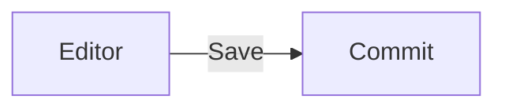

The site you are reading lives in `docs-site/`, a standalone TanStack Start
project next to the application. It has its own dependencies, its own build and
its own deployment. Changing the documentation never rebuilds the app, and vice
versa.

## Running it

```bash
cd docs-site
bun install
bun run dev
```

It serves on **http://localhost:3100** — the app uses 3000, the marketing page
uses Vite's default, so nothing collides.

## Adding a page

Create a Markdown file under `content/docs/<section>/`:

```markdown
---
title: Backups
description: One sentence, shown in the sidebar and in search results.
order: 50
---

Your content here.
```

That is the whole procedure. **Pages are discovered from the file tree**, so
there is no index to update and no route to declare. The `order` field places
the page within its section; leave gaps of ten so inserting later does not mean
renumbering everything.

Link between pages with root-relative paths — `/features/media`, not
`../features/media.md`.

## Adding a section

Sections are the one thing declared explicitly, in `content/docs/docs.config.ts`:

```ts
{ id: "guides", label: "Guides", icon: "map", order: 30 }
```

The `id` must match the folder name. The `icon` resolves against
`src/features/docs/components/docs-icon.tsx`; add an entry there if you want an
icon that is not yet mapped.

Pages are deliberately **not** listed in the config. Two sources of navigation
truth drift apart within a week.

## The landing page

`docs.config.ts` also holds the cards on the home page, grouped by section. Each
card points at a slug, and **the build fails if the slug does not resolve** — a
card cannot outlive the page it advertises.

## Diagrams

Mermaid is available in any page:

````markdown

````

Label your arrows. A diagram whose edges are unlabelled says less than the
sentence it replaced.

## Before you commit

```bash
bun run generate-routes
bunx tsc --noEmit
bunx biome check .
bun run build
```

## Deploying

The docs site deploys independently. On Vercel: Root Directory `docs-site`,
build command `bun run build`, output `.output/`. Any Nitro-capable host works
the same way, since the build is a Nitro server bundle.

Because it is a separate project, you can ship a documentation fix without
touching the application deployment at all.
