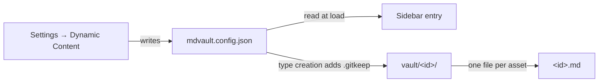

Articles and posts cover most needs. The vault covers the rest: it lets you
declare content types of your own — projects, recipes, lab notes, bookmarks —
each with its own folder, icon and editor.

A type called "Projects" gets its own sidebar entry, its own list, and its own
folder in the repository — none of which required touching the code:


## Declaring a type

**Settings → Dynamic Content** writes `mdvault.config.json` at the root of your
repository:


```json
{
  "version": 1,
  "assetTypes": [
    { "id": "projects", "label": "Projects", "icon": "folder", "editor": "rich" },
    { "id": "notes", "label": "Field notes", "icon": "flask", "editor": "plain" }
  ]
}
```

| Field | Rule |
|---|---|
| `id` | `^[a-z][a-z0-9-]*$`, 2–30 characters. Becomes the folder name and a URL segment |
| `label` | Up to 40 characters, shown in the sidebar |
| `icon` | One of the twelve icons below |
| `editor` | `rich` for WYSIWYG, `plain` for text |

Available icons: `note`, `book`, `school`, `bulb`, `checklist`, `bookmark`,
`folder`, `flask`, `code`, `pencil`, `star`, `archive`. Use a supported value;
unknown icon names make the stored configuration invalid.

Ids must be unique, cannot exceed twenty types, and cannot use a reserved word:
`articles`, `posts`, `media`, `settings`, `vault`, `new`, `edit`, `cms` — each
of those already names a route.

## Where the content goes

Assets of a type live in `vault/<id>/`. A type declared as `projects` stores
`vault/projects/my-first-project.md`. Adding the type writes the configuration
first, then creates its folder with a `.gitkeep` placeholder.



## Frontmatter

A vault asset carries the same fields as an article — title, description,
published, lang, author, tags, coverImage, dates and optional `translationKey`,
plus `type`, which repeats the type id. Translations link entries of the same
custom type across configured content languages. They do not generate translated
text automatically.

Rich types share the article editor's block deletion, image replacement,
callouts and preview tools. Plain types keep text literal in both the editor
and the reading page. See [Editor](/docs/features/editor).

## Renaming and deleting a type

The type id cannot be changed through the edit form. You can update its label,
icon or rich/plain editor choice. A different id requires a new type and an
explicit content migration in Git; changing configuration alone does not move
files. Changing the label or icon affects display, not file paths.

Deleting a type removes it from the sidebar. The content remains in the
repository, which is the point of storing everything in Git.
